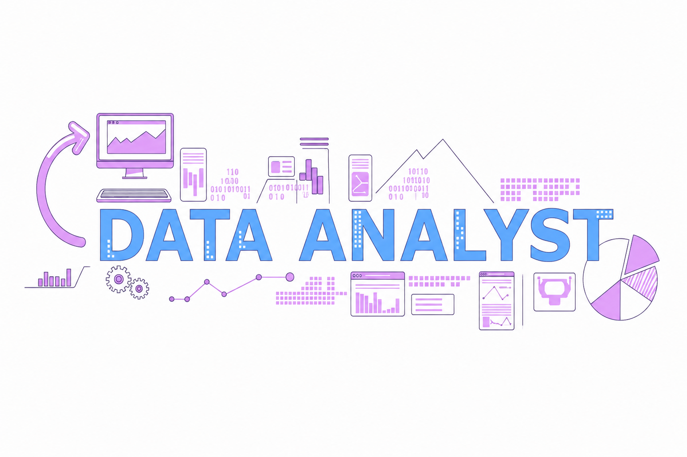

  

<h1 align="center">Hi 👋, I'm Saify Sharma</h1>

  Data Analyst passionate about turning data into meaningful business insights.
  I enjoy working with SQL, Python, Power BI and exploring AI-powered analytics.

---

## 👨‍💻 About Me

- 📊 Data Analyst focused on turning data into actionable insights
- 🧮 Working with SQL, Python, Power BI and Excel
- 🔍 Interested in business analytics and data-driven decision making
- 🚀 Building real-world data analytics projects
- 🤖 Exploring AI + Data Analytics
- 🌱 Always learning and building

---

## 📫 Connect With Me

  
  

---

## 🛠️ Languages & Tools

  

  
  
  
  

---

## 📊 Featured Projects

### 🛒 E-commerce Business Analytics

Analyzed sales performance, product performance, customer behavior, marketing effectiveness, and the purchase funnel using SQL and Power BI.

**Tools:** MySQL | Power BI

🔗 [View Project](https://github.com/saifysharma/ecommerce-business-analytics)

---

### 👥 Customer Retention & Marketing Performance Analytics

Analyzed customer retention, churn, customer lifetime value, customer experience, and marketing-channel performance using Python and SQL.

**Tools:** Python | SQL | Pandas | NumPy | MySQL

🔗 [View Project](https://github.com/saifysharma/customer_retention_marketing_performance_analytics)

---

### 🚗 Uber Ride Analytics 2024

Analyzed Uber ride bookings to understand booking outcomes, cancellations, and operational factors affecting successful ride completion.

**Tools:** Python | SQL | Power BI

🔗 [View Project](https://github.com/saifysharma/Uber-Ride-Analysis)

---

## 🌱 Currently Learning

- Advanced SQL
- Business Analytics
- AI + Data Analytics
- Data-driven problem solving

---

## ⭐ Thanks for visiting my profile!

  Let's connect and build something meaningful with data.

